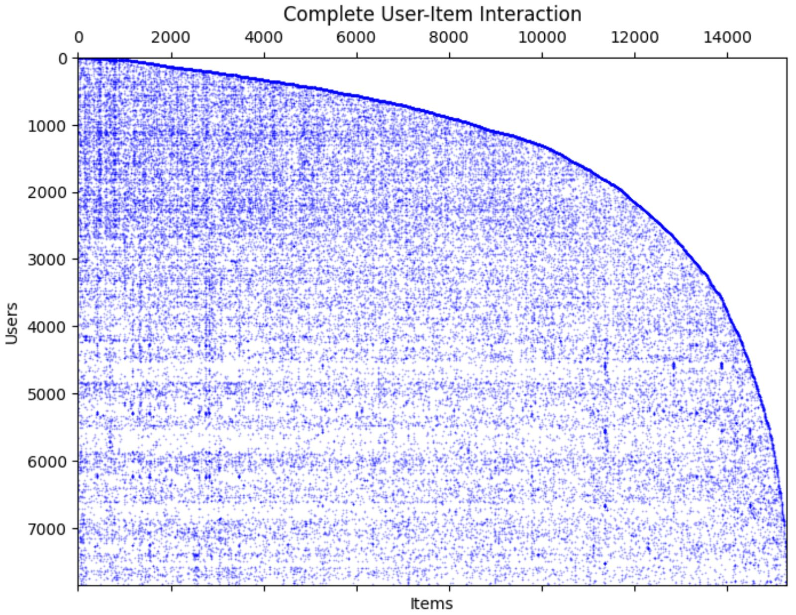
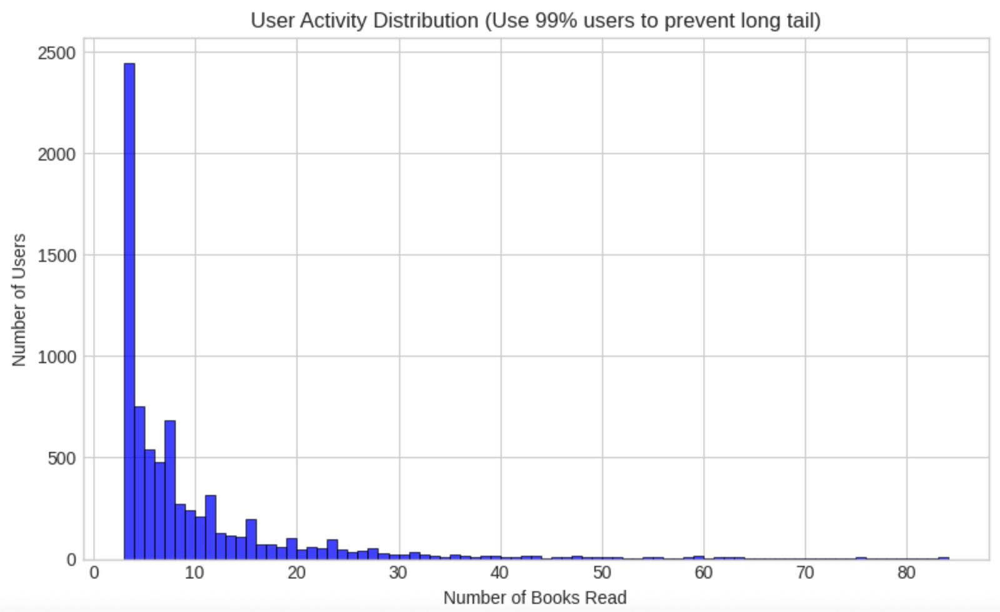
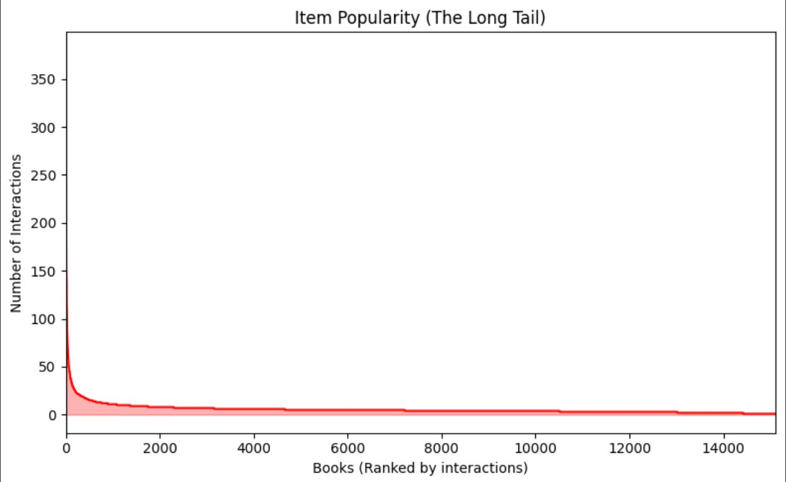
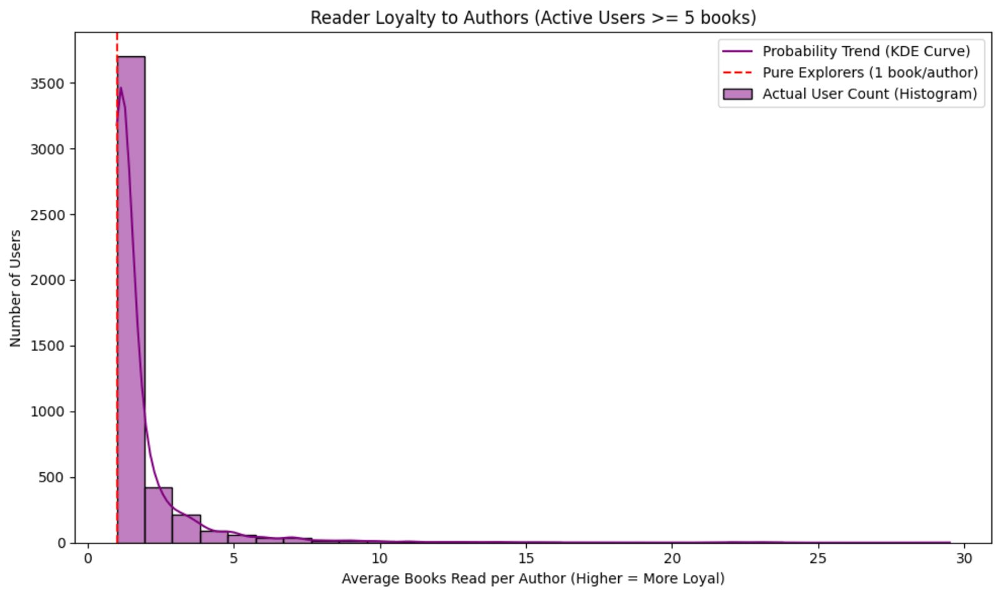
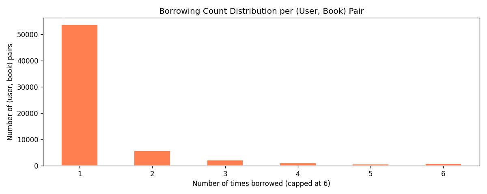
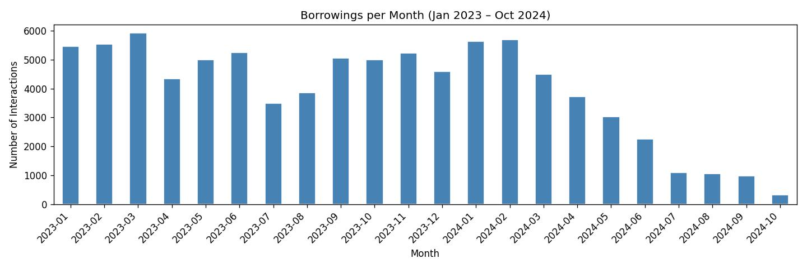

# Book Recommendation System

[](#performance-summary)
[](https://www.python.org/downloads/)

> **Project Video Presentation:** https://www.youtube.com/watch?v=awYwOtI_TZY

## 1. Project Overview
This project builds a hybrid book recommendation system for a library dataset (87,047 interactions across 7,838 users and 15,291 books). We developed nine key models of increasing complexity — from basic collaborative filtering to a hybrid combining CF, TF-IDF content filtering, popularity, and Graph Random Walk with Restart — achieving a final **Precision@10 of 0.1739** on the Kaggle leaderboard. In total, we ran over 25 experiments including Optuna hyperparameter search, seasonal weighting, session-based signals, and data augmentation; the eight models documented here represent the most significant milestones in that process. The system is deployed as an interactive web application where users can browse books by category and receive personalised recommendations.

---

## 2. Exploratory Data Analysis (EDA)

We use two main datasets to build our recommendation model. The first one is the interaction dataset with 87,047 interactions across 7,838 users and 15,291 books with timestamps for each interaction. The second dataset is a list of 15,291 books with title, author, publisher, subjects, and ISBN provided for each book. In advance to constructing our interaction model, it would be useful to conduct exploratory data analysis to understand our datasets better.

### Missing Values in the Books Dataset
In advance of diving into the EDA process, it is crucial to address the completeness of our book metadata. A preliminary check reveals a notable proportion of missing values across key attributes:
*   Author: 17.35% missing
*   Subject: 14.54% missing
*   ISBN: 4.73% missing
*   Publisher: 0.16% missing

While pure collaborative filtering (CF) models rely solely on user-item interaction matrices and remain unaffected by these gaps, such metadata becomes vital when developing advanced hybrid or content-based models. To build a more robust recommendation system moving forward, we can leverage the available ISBN data and try to query external databases via open-source APIs, allowing us to impute the missing authors and subjects effectively.


### EDA with Graphs
*   **Interaction Matrix:** The interaction matrix below provides an initial visual overview of our dataset. A smooth frontier is visible, which is highly unusual of real-world interaction data and strongly suggests that this dataset was synthetically generated. Furthermore, we observe that users with higher IDs exhibit a broader range of book interactions across the item spectrum. Conversely, users with IDs below 2,000 interact more densely but are confined to a limited subset of books. While recommending based on this mathematical boundary could inflate our prediction scores, we have intentionally chosen to ignore this artifact. Exploiting it would lead to a model that fails to generalize to real-world recommendation scenarios.
    
    
    
*   **User Activity:** From the bar chart demonstrated below, the majority of the users read fewer than 10 books. Although we still have some readers who interact with over 300 books, 69.06% users interact with less and 10 books, and 40.79% of the readers interact with even fewer than 5 books. Due to a lack of interaction data for many users, standard user-based collaborative filtering will struggle to find similar peers for these inactive users. To address this "cold-start" issue, our model will likely need to rely on hybrid approaches, incorporating book content features or baseline popularity metrics for early recommendations.

    

*   **Item Popularity:** This chart reveals a long tail distribution in book interactions. The top 5% popular book account for 23.70% all interactions, while over half (52.23%) have fewer than 5 interactions. While recommend popular books can be useful, we need to be cautious of popularity bias, where the model defaults to suggesting only top hits for everyone. Implementing strategies like item-based collaborative filtering or content-based matching can possibly help us discover relevant hidden gems from the tail.

    

*   **Reader Loyalty:** evaluate author preference, we calculated the 'average books read per author' for 4,641 active users (those with ≥ 5 read books). The resulting chart displays a heavily right-skewed distribution. The dominant peak at 1.0 indicates that most users are "Pure Explorers," typically consuming only one book per author. Conversely, the extended right tail reveals a dedicated segment of "Loyal Fans," with 20.2% of active users reading multiple works (≥ 2) by the same author. This behavioral divide suggests a dual recommendation strategy: leveraging collaborative filtering to capture the diverse, cross-author tastes of the majority, while integrating author-based content features to satisfy the specific preferences of niche loyalists.
  
    

*   **Repeat Borrowing:** 16.2% of unique (user, book) pairs were borrowed more than once, indicating strong affinity for specific titles. We tested a repeat-signal component that boosted frequently re-borrowed books, but it yielded only a marginal CV improvement (+0.0003) and no improvement on the Kaggle leaderboard.

    

*   **Temporal Distribution:** Borrowings across 2023 show a mild seasonal pattern — a summer dip (Jul: 3,495; Aug: 3,852) and higher activity in winter/spring (Mar: 5,927; Jan–Feb: ~5,500). In 2024, interactions drop sharply from March onwards, reaching near-zero by October. The cause of this decline is unclear: it could be a data collection cutoff, or interactions from March–October 2024 may have been withheld for the Kaggle test set. We tested seasonal weighting (boosting autumn/winter interactions (Oct–Feb) and spring/summer interactions from 2023 (Mar–Sep)) but observed no consistent improvement in 5-fold CV, suggesting the Kaggle holdout is likely random across time — though we cannot rule out a temporal holdout.

    

---

## 3. Data Augmentation
To improve recommendation quality, we enriched the original book metadata using three external sources:
*   **Google Books API:** Queried by ISBN to fill missing Author fields. Using API keys, we filled **1,267 missing authors** — reducing the missing rate from 17.4% to 9.1%. Coverage was limited because the dataset is primarily French-language books, which are underrepresented in Google Books.
*   **Bibliothèque nationale de France (BnF) API:** Free API with no quota, specialised in French books. More effective than Google Books for this dataset.
*   **Claude AI (Haiku model):** Classified all 15,291 books using the Anthropic Message Batches API (`data_enrichment/classification_script.py`). Each book is assigned a hierarchical classification: `book_type` (academic, fiction, comics, practical, etc.), `discipline` (for scholarly books: linguistics, sociology, history, etc.), and `topic` (for general books: travel, cooking, biography, etc.). Results saved in `data/augmented/books_classified.csv` and used by the recommendation website to enable category-based browsing.

**Outcome:** Despite thorough enrichment, 5-fold CV showed no measurable improvement in Precision@10 (Model 9 vs Model 7: 0.0556 vs 0.0560). The bottleneck is interaction sparsity, not metadata quality — see `models/Model_9_Augmented_Metadata.ipynb` for the full experiment.

---

## 4. Model Architectures & Experiments

### Performance Summary (Validation Results)
| Technique | Precision@10 | Recall@10 |
| :--- | :--- | :--- |
| **Model 1: User-User CF** | 0.0477 | 0.2616 |
| **Model 2: Item-Item CF** | 0.0477 | 0.2359 |
| **Model 3: User & Item Hybrid** | 0.0524 | 0.2681 |
| **Model 4: U + I + Content** | 0.0532 | 0.2741 |
| **Model 5: U + I + Content + XGBoost** | 0.0511 | 0.2738 |
| **Model 6: U + I + Content + Pop + Time decay (hand-tuned)** | 0.0555 | 0.2940 |
| **Model 7: CF + Content + Pop + Graph RWR (hand-tuned)** | **0.0560** | **0.2950** |
| **Model 8: Model 7 + Optuna weight optimization** | **0.0562** | **0.2951** |
| **Model 9: Model 7 + Augmented Metadata (Google Books API + BnF)** | 0.0556 | 0.2933 |

## Model Description

### Models 1 & 2: User-User CF and Item-Item CF
Classic collaborative filtering baselines. Model 1 recommends books liked by similar users; Model 2 recommends books similar to what the user has already read. Both use cosine similarity on binary interaction matrices.

### Model 3: User & Item Hybrid
A weighted blend of user-based (76%) and item-based (24%), chosen through grid search. Outperforms either approach alone by combining both similarity signals.

### Model 4: U + I + Content
Adds TF-IDF content-based filtering to the hybrid CF. Each book is represented as a bag-of-words vector from Title, Author, Subjects, and Publisher. User profiles are built as the mean TF-IDF vector of their read books.

### Model 5: U + I + Content + XGBoost
A two-stage reranker: CF and content scores are used as features to train an XGBoost classifier (binary:logistic, 1:4 negative sampling, Optuna-tuned hyperparameters). Despite the added complexity, the model underperforms simpler hybrids due to limited training signal from sparse interactions.

### Model 6: U + I + Content + Popularity + Time Decay
Integrates three components: CF (75%), Content (20%), and Global Popularity (5%). Key improvements over Model 4:
- **Rank-based time decay** (decay=0.03): the most recent borrowing gets weight 1.0; older books fade by factor 0.97 per step — based on borrowing order, not calendar time
- **Author×2, Subjects×2** in TF-IDF to emphasize thematic relevance and creator loyalty
- **Log-normalized popularity** as a gentle tiebreaker without popularity bias

### Model 7: CF + Content + Popularity + Graph RWR (Best Model — Kaggle score: **0.1739**)
Our best model adds **Graph Random Walk with Restart** to Model 6:
- **CF** (time-decay weighted, sign-preserving log normalization): 45% user-based + 55% item-based
- **Content** (count-weighted TF-IDF profiles, Author×2, Subjects×2): 20%
- **Popularity** (log-normalized): 5%
- **Graph RWR** (bipartite user-book graph, α=0.7, 15 iterations): 20%
- Final blend: `0.8 × normalize(0.75×CF + 0.20×Content + 0.05×Pop) + 0.2×Graph`

The graph component uncovers hidden connections between users and books that direct CF misses, by propagating signals across the full borrowing network.

### Model 9: Model 7 + Augmented Metadata
Model 7 retrained with enriched book metadata (Google Books API + BnF). No measurable improvement — see Section 3 and `models/Model_9_Augmented_Metadata.ipynb`.

### Hyperparameter Optimization
Different methods were used at different stages:
- **Model 3**: grid search over α ∈ [0, 1] (step 0.02) to find the optimal user/item CF blend — 76% user-based, 24% item-based.
- **Model 4**: grid search over α ∈ [0, 1] (step 0.1) to find the optimal user/item/content blend - 20% user-based, 10% Item based, 70% Content based
- **Model 5**:
- **Model 7**: component weights (CF 75%, Content 20%, Popularity 5%, Graph 20%) were found through manual experimentation and validated on 5-fold CV.
- **Model 8: Optuna** (200 trials, 5-fold average as objective): automated search over all component weights simultaneously. The Optuna-optimized submission scored 0.1725 on Kaggle, while the hand-tuned Model 7 scored **0.1739** — confirming that 5-fold CV alone does not perfectly proxy the Kaggle holdout.

### Cross-Validation Strategy
All CV results use temporal 5-fold cross-validation: for each user, interactions are split chronologically into 5 equal folds, with each fold taking a turn as the test set (20% of interactions) while the remaining 80% are used for training. The final score is the average across all 5 folds.

An important finding: **averaging across all 5 folds produced better Kaggle predictions than using only the last fold** — which would be the natural choice for time-series data. We investigated whether the Kaggle test set is a random or temporal holdout by testing period-specific popularity boosts and dedicated temporal validations. None produced consistent improvement, suggesting the holdout is likely **random across time** — though we cannot fully rule out a temporal holdout given the visible data drop-off from March 2024.

---

## 5. Evaluation: The Best Model

**Model 7** (CF + Content + Popularity + Graph RWR) is our best model, achieving **Precision@10 = 0.1739** on the Kaggle leaderboard — meaning on average 1.7 correct recommendations out of every 10 suggested, across 15,291 possible books.

### Where the model works well
- **Active users** with 10+ interactions: CF finds reliable similar users and items
- **Thematically consistent readers**: content-based TF-IDF reinforces genre preferences
- **Books with rich metadata**: author and subject fields improve content similarity

### Where the model struggles
- **Cold-start users** (69% of users have fewer than 10 interactions): insufficient data for CF to find meaningful neighbors
- **Long-tail books**: 52% of books have fewer than 5 interactions, making them nearly invisible to CF
- **Multilingual/mixed collections**: TF-IDF treats French and English vocabulary independently

---

## 6. How to Run the Code

### Reproduce model evaluation (Jupyter notebooks)
All models are documented step-by-step in the `models/` folder. Open any notebook in Jupyter and run all cells.

```bash
pip install numpy pandas scikit-learn scipy matplotlib seaborn
jupyter notebook models/Model_7_CF_Content_Pop_Graph_RWR.ipynb
```

### Run the recommendation website
See `website/README_website.md` for full instructions. Quick start:

```bash
# Terminal 1 — backend (from repo root)
pip install fastapi uvicorn scikit-learn pandas numpy scipy
.venv/bin/uvicorn website.backend.main:app --port 8001

# Terminal 2 — frontend
cd website/frontend && npm install && npm run dev
```

Open http://127.0.0.1:5180/

---

## 7. Repository Structure

```
├── data/
│   ├── items.csv                          # Original book metadata (15,291 books)
│   ├── interactions_train.csv             # User-book interactions (87,047 rows)
│   └── augmented/
│       └── books_classified.csv          # Hierarchical book classification (used by website)
│
├── models/                                # Jupyter notebooks — one per model
│   ├── EDA.ipynb
│   ├── Model_1_2_User_User_Item_Item_CF.ipynb
│   ├── Model_3_User_Item_Hybrid.ipynb
│   ├── Model_4_U_I_Content.ipynb
│   ├── Model_5_U_I_Content_XGBoost.ipynb
│   ├── Model_6_U_I_Content_Pop_TimedDecay.ipynb
│   ├── Model_7_CF_Content_Pop_Graph_RWR.ipynb
│   ├── Model_9_Augmented_Metadata.ipynb
│   └── ...
│
├── data_enrichment/                       # Scripts for enriching book metadata
│   ├── classification_script.py          # Claude AI hierarchical book classifier
│   ├── enrich_google.py                  # Google Books API — fill missing Authors
│   └── enrich_bnf.py                     # BnF API — fill missing Authors (French books)
│
├── website/                               # Recommendation web application
│   ├── backend/                          # FastAPI backend
│   ├── frontend/                         # React + Vite frontend
│   └── README_website.md                 # Instructions to run the website
│
└── images/                               # EDA charts used in README
```
