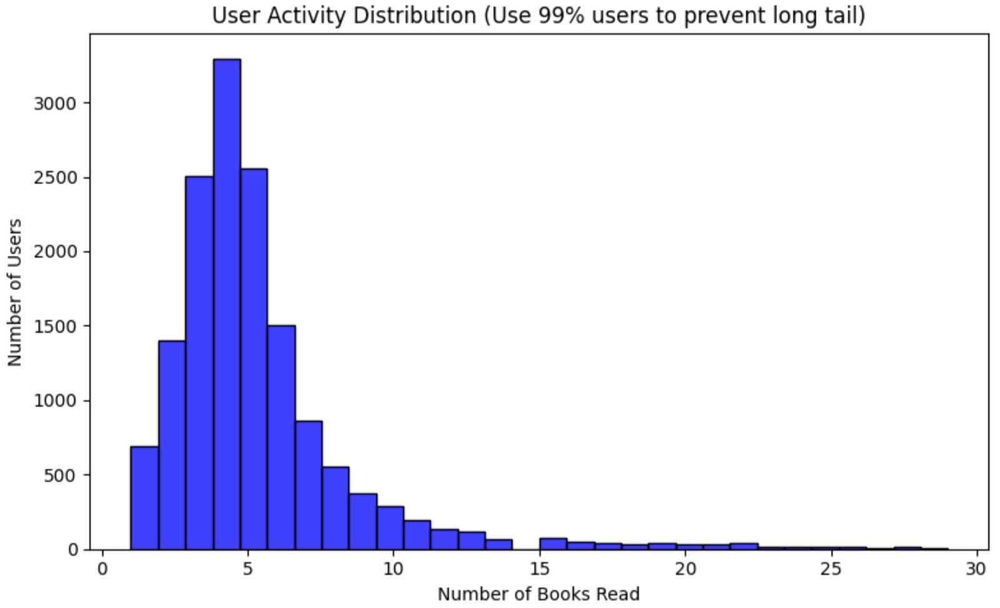

# Book Recommendation System 📚

[](#performance-summary)
[](https://www.python.org/downloads/)

> **Project Video Presentation:** [Link to your video here]

## 1. Project Overview
This project implements a hybrid recommendation engine for a library dataset. The goal is to achieve a Precision@10 score higher than **0.1452** on the competition leaderboard by leveraging collaborative filtering and advanced machine learning techniques.

---

## 2. Exploratory Data Analysis (EDA)

### Interaction Data
*   **Sparsity Analysis:** Visualizing the user-item interaction matrix.
*   **User Activity:** Distribution of book rentals per user.
    

*   **Item Popularity:** Identifying the "Long Tail" in book rentals.
    

### Items Metadata
*   **Genre & Author Distribution:** Analysis of the most frequent categories.
*   **Year of Publication:** Historical trends of the library's collection.
*   **Missing Values:** Assessment of metadata completeness (ISBN, Descriptions, etc.).

---

## 3. Data Augmentation
To improve recommendation quality, we enriched the original metadata using external sources:
*   **Google Books API:** Fetched missing descriptions and categories.
*   **ISBNDB:** (Optional) Supplemented publisher and language data.
*   **Feature Engineering:** Combined original metadata with augmented text data for content-based signals.

---

## 4. Model Architectures & Experiments

### Hyper-parameter Optimization
We used [Method, e.g., Optuna / GridSearch] to tune:
*   K-neighbors for CF models.
*   Learning rates and depth for Boosting models.
*   Embedding dimensions for Matrix Factorization.

### Performance Summary (Validation Results)
| Technique | Precision@10 | Recall@10 |
| :--- | :--- | :--- |
| **User-User CF** | 0.XXXX | 0.XXXX |
| **Item-Item CF** | 0.XXXX | 0.XXXX |
| **XGBoost / Hybrid (Best)** | **0.XXXX** | **0.XXXX** |

> **Note:** The above results are calculated using Cross-Validation on the training set to ensure label integrity.

---

## 5. Evaluation: The Best Model
The **[Insert Best Model Name, e.g., XGBoost Hybrid]** outperformed others by integrating collaborative signals with item metadata. 

### Good vs. Bad Predictions
#### Good Predictions
*   **User A History:** [List 1-2 genres/books]
*   **Recommendation:** [Book X]
*   **Why it works:** Align with the user's preference for [Genre].

#### Bad Predictions
*   **User B History:** [List 1-2 genres/books]
*   **Recommendation:** [Book Y]
*   **Why it failed:** Likely due to [Reason, e.g., Popularity bias or niche interest].

---

## 6. How to Run the Code
```bash
# Clone the repository
git clone [https://github.com/your-username/your-repo.git](https://github.com/your-username/your-repo.git)

# Install dependencies
pip install -r requirements.txt

# Run the training & evaluation script
python main.py
